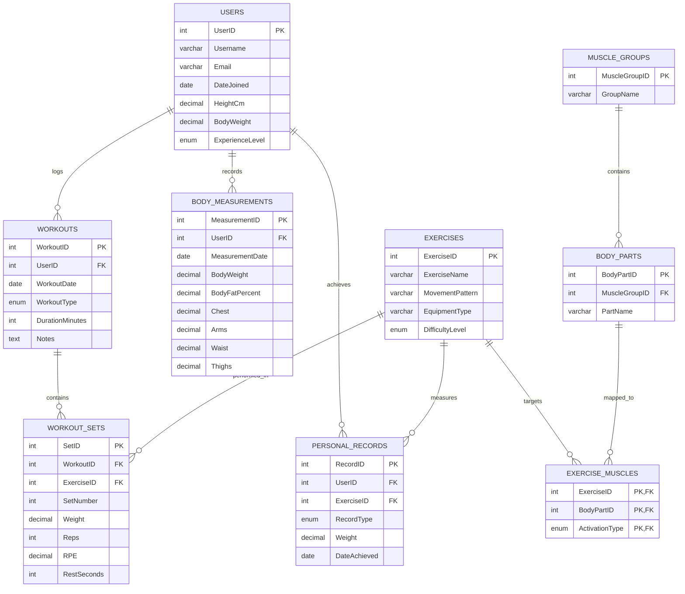

# Workout Tracker entity relationships

```mermaid
erDiagram
    USERS ||--o{ WORKOUTS : logs
    USERS ||--o{ PERSONAL_RECORDS : achieves
    USERS ||--o{ BODY_MEASUREMENTS : records
    WORKOUTS ||--o{ WORKOUT_SETS : contains
    EXERCISES ||--o{ WORKOUT_SETS : performed_in
    EXERCISES ||--o{ PERSONAL_RECORDS : measures
    EXERCISES ||--o{ EXERCISE_MUSCLES : targets
    BODY_PARTS ||--o{ EXERCISE_MUSCLES : mapped_to
    MUSCLE_GROUPS ||--o{ BODY_PARTS : contains
    USERS {
        int UserID PK
        varchar Username
        varchar Email
        date DateJoined
        decimal HeightCm
        decimal BodyWeight
        enum ExperienceLevel
    }
    MUSCLE_GROUPS {
        int MuscleGroupID PK
        varchar GroupName
    }
    BODY_PARTS {
        int BodyPartID PK
        int MuscleGroupID FK
        varchar PartName
    }
    EXERCISES {
        int ExerciseID PK
        varchar ExerciseName
        varchar MovementPattern
        varchar EquipmentType
        enum DifficultyLevel
    }
    EXERCISE_MUSCLES {
        int ExerciseID PK,FK
        int BodyPartID PK,FK
        enum ActivationType PK,FK
    }
    WORKOUTS {
        int WorkoutID PK
        int UserID FK
        date WorkoutDate
        enum WorkoutType
        int DurationMinutes
        text Notes
    }
    WORKOUT_SETS {
        int SetID PK
        int WorkoutID FK
        int ExerciseID FK
        int SetNumber
        decimal Weight
        int Reps
        decimal RPE
        int RestSeconds
    }
    PERSONAL_RECORDS {
        int RecordID PK
        int UserID FK
        int ExerciseID FK
        enum RecordType
        decimal Weight
        date DateAchieved
    }
    BODY_MEASUREMENTS {
        int MeasurementID PK
        int UserID FK
        date MeasurementDate
        decimal BodyWeight
        decimal BodyFatPercent
        decimal Chest
        decimal Arms
        decimal Waist
        decimal Thighs
    }
```
